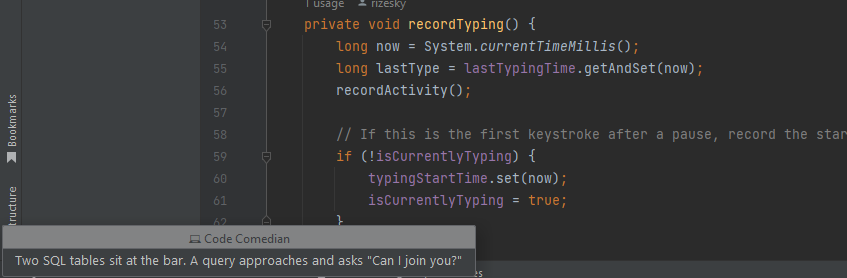

# Zokes -  Joke plugin for IntelliJ

Zokes delivers timely humor to brighten your coding sessions with various categories of English jokes right in your IDE.

## 🚀 Features

- **Diverse Joke Categories**: Programming, pun, misc, dark, spooky, and Christmas jokes
- **Customizable Delivery**: Control when and how jokes appear
- **Smart Timing**: Context-aware joke delivery that respects your focus
- **Theme Integration**: Automatically matches your IDE theme
- **Position Options**: Choose where joke notifications appear
- **Minimal Impact**: Lightweight with minimal resource usage

## 📥 Installation

### From JetBrains Marketplace

1. In your IntelliJ IDE, go to **Settings/Preferences** → **Plugins** → **Marketplace**
2. Search for "Zokes"
3. Click **Install**
4. Restart your IDE when prompted

### Manual Installation

1. Download the latest release `.zip` file from the [releases page](https://github.com/xyzzes/zokes/releases)
2. In your IntelliJ IDE, go to **Settings/Preferences** → **Plugins**
3. Click the gear icon and select **Install Plugin from Disk...**
4. Navigate to the downloaded file and click **OK**
5. Restart your IDE when prompted

## ⚙️ Configuration

Access Zokes settings via **Settings/Preferences** → **Tools** → **Zokes Setting**

### Basic Settings

- **Generate jokes**: Toggle joke delivery on/off
- **Jokes interval**: Set the time between jokes (10-60 seconds)

### Joke Categories

Choose which joke categories to include:
- 💻 Programming
- 😏 Pun
- 🎭 Misc
- 🌚 Dark
- 👻 Spooky
- 🎄 Christmas

### Joke Style

- **Joke Type**: Choose between one-liners or two-part (setup-punchline) jokes

### Smart Timing

- **Use Smart Timing**: Enable context-aware joke delivery
- **Focus threshold**: How long of continuous typing is considered "deep focus" (10-600 seconds)
- **Break threshold**: How long of inactivity is considered a "break" (10-300 seconds)
- **Prioritize showing jokes during breaks**: Show jokes when you appear to be taking a break

### Appearance

- **Display Mode**: Choose between full or minimalistic UI
- **Notification Position**: Select where jokes appear (e.g., bottom right corner)
- **Display Time**: How long jokes remain visible (1-30 seconds)
- **Match IDE theme**: Automatically adapt to your IDE's dark/light theme

## 🧠 Smart Timing Explained

The Smart Timing feature makes joke delivery context-aware:

- **Focus Detection**: When you're typing continuously for the specified threshold time, Zokes recognizes you're in deep focus and avoids interrupting with jokes.
- **Break Detection**: When you haven't interacted with the IDE for the specified threshold time, Zokes recognizes you might be taking a break and can deliver jokes during this time.
- **Priority Option**: Choose whether to prioritize showing jokes during detected breaks.

This ensures jokes enhance your coding experience rather than disrupt your workflow.

## 📸 Screenshots


*Zokes main settings panel*


*Example of a joke notification-Simple mode*


*Example of a joke notification-Full fun mode*

## 🔧 Development

### Requirements

- Java 11+
- IntelliJ IDEA with Gradle
- IntelliJ Platform Plugin SDK

### Setup

1. Clone the repository:
   ```bash
   git clone https://github.com/rizesky/zokes.git
   cd zokes
   ```

2. Import the project into IntelliJ IDEA as a Gradle project

3. Build the plugin:
   ```bash
   ./gradlew buildPlugin
   ```

### Running in Development

Run the plugin in a development instance of IntelliJ IDEA:
```bash
./gradlew runIde
```

## 📄 License

See the [LICENSE](LICENSE) file for details.

---

Made with ❤️ by [rizesky](https://github.com/rizesky)